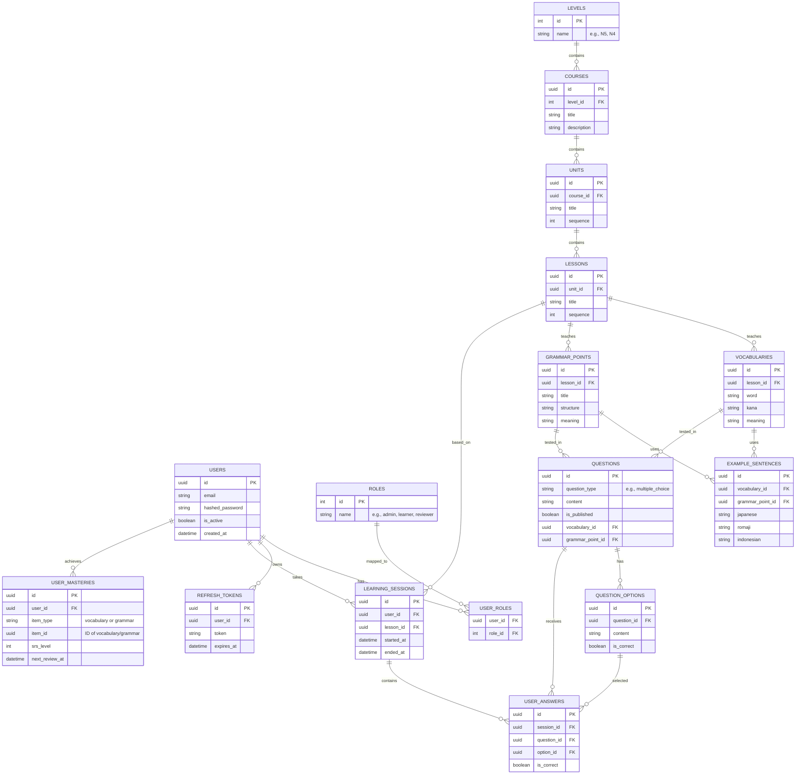

# Rancangan ERD Awal - Nihongo Learning API

Diagram ini menunjukkan rancangan skema Entity Relationship awal berdasarkan scope di `tahap1.md`.
Tabel-tabel ini akan dibuat secara bertahap selama pengembangan proyek.

## Mermaid ER Diagram

## Deskripsi Domain Utama
1. **Auth**: Berisi user, role, relasi user dengan role (RBAC), serta token refresh.
2. **Curriculum**: Menggambarkan level bahasa (seperti N5), ke kursus, unit, sampai pecahan pelajaran terkecil (lesson).
3. **Content**: Menyimpan *vocabulary* dan *grammar point* yang direlasikan ke lesson, serta kalimat contoh (example_sentences).
4. **Question**: Tabel soal-soal latihan (baik dibuat manual atau dari AI generator).
5. **Learning & Progress**: Menyimpan sesi belajar *user* (`learning_sessions`), *user answers* (jawaban per soal), dan *mastery* (tingkat penguasaan berbasis interval pengulangan/SRS).
6. *(Untuk domain yang lebih kompleks seperti JLPT Simulation dan Job Queue AI, tabelnya akan ditambahkan kemudian pada sprint bersangkutan)*.
